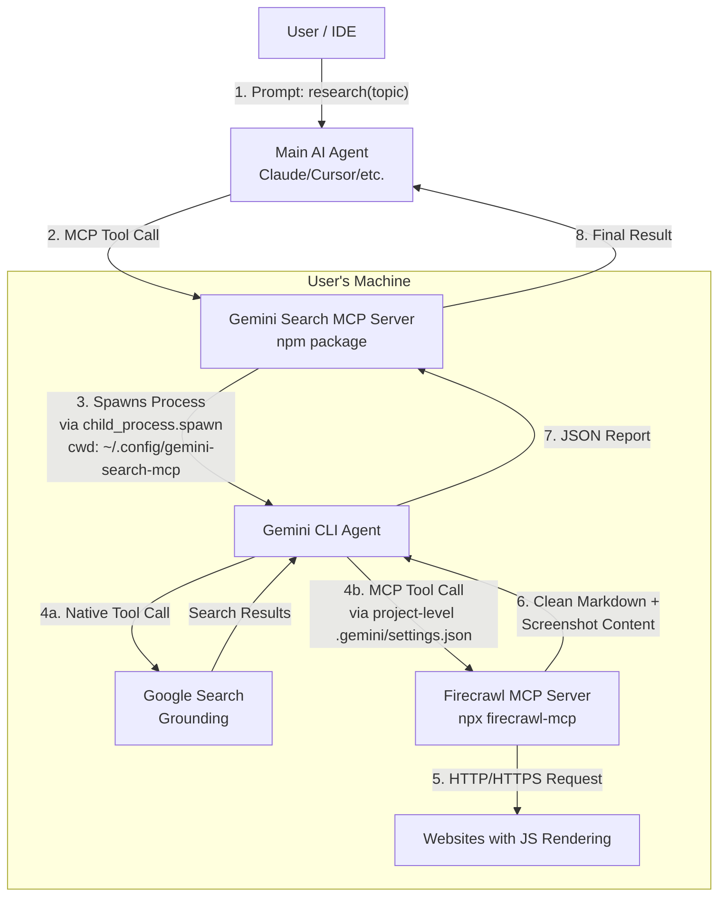

# Product Requirements Document (PRD): Gemini Search MCP

**Version:** 6.4
**Date:** January 10, 2026
**Status:** Draft - Implementation Ready (Updated with SDK corrections and Phase 0 expansion)

## 1. Executive Summary

The **Gemini Search MCP** is a Node.js-based Model Context Protocol (MCP) server that wraps the official Google Gemini CLI. It exposes two search tools—`search` and `deep_search`—to any MCP-compliant client (e.g., Claude Desktop, Cursor, generic AI Agents).

Unlike standard search tools that return shallow snippets, this server acts as a **Sub-Agent Orchestrator**. When called, it spawns an autonomous Gemini CLI instance capable of multi-step reasoning, executing live Google Searches (via Grounding), and scraping web pages with JavaScript rendering (via Firecrawl MCP) to produce a comprehensive search report.

**Key Innovation:** The package creates a dedicated configuration directory with project-level Gemini CLI settings that pre-configure Firecrawl MCP. When Gemini CLI runs from this directory, it automatically has access to Firecrawl tools for JavaScript rendering. Firecrawl converts pages to clean Markdown optimized for LLM consumption, with built-in retry logic and rate limiting. If Firecrawl is unavailable, Gemini CLI gracefully falls back to its built-in `web_fetch` tool.

**Distribution:** npm package (`gemini-search-mcp`) installed globally via `npm install -g`.

## 2. Problem Statement

Current AI "search" capabilities suffer from four main limitations:

1. **Shallow Context:** Tools like Brave Search or Google Custom Search only return snippets (meta descriptions), not the full page content needed for deep analysis.
2. **Quota Bottlenecks:** High-quality "AI Search" APIs (like Perplexity or Google AI Mode) often have strict rate limits or high costs.
3. **Lack of Agency:** A standard search tool is passive. It cannot decide to "click" a link, read it, realize it's irrelevant, and search again. It relies on the *Main AI* to do that loop, which consumes the Main AI's context and credits.
4. **JavaScript Rendering:** Many modern websites use JavaScript to load content dynamically. Traditional HTTP scrapers miss this content, requiring either browser automation or sophisticated rendering engines.

## 3. Architecture: "The Russian Doll" Pattern

The system uses a hierarchical agent approach with Firecrawl MCP for web scraping:



**Key Architectural Points:**

1. **npm Package**: `gemini-search-mcp` is installed globally via npm, available as `gemini-search-mcp` command.

2. **Configuration Directory**: The package creates `~/.config/gemini-search-mcp/` on first run, containing a project-level `.gemini/settings.json` that pre-configures Firecrawl MCP.

3. **Gemini CLI Prerequisite**: Users must have `@google/gemini-cli` installed and authenticated (browser auth, API key, etc.) before using this package.

4. **Working Directory Isolation**: When spawning the `gemini` process, the package sets `cwd` to `~/.config/gemini-search-mcp/`, ensuring Gemini CLI picks up the project-level settings with Firecrawl MCP configuration.

5. **Graceful Degradation**: If Firecrawl MCP fails to connect (missing API key, service unavailable, etc.), Gemini CLI ignores it and uses its built-in `web_fetch` tool for basic scraping.

6. **Two-Transport Support**: `gemini-search-mcp` server supports both stdio (for local clients like Claude Desktop) and Streamable HTTP (for remote clients).

## 3.5. Clarified Design Decisions (v6.0)

Based on implementation planning and user requirements, the following design decisions have been confirmed:

| Aspect | Decision | Rationale |
|--------|----------|-----------|
| **Distribution** | npm package | Global npm install (`npm install -g gemini-search-mcp`) for system-wide availability |
| **Target Client** | Universal/Generic MCP compatibility | Works across Claude Desktop, Cursor, and any MCP-compliant client |
| **Progress Updates** | Console logging only | Log progress messages to console for debugging (stdout/stderr); no structured progress API |
| **CLI Interaction** | Stdin piping | Pipe prompt to `gemini` CLI via stdin (no length limitations unlike --prompt flag) |
| **Retry Logic** | JSON extraction with retry | If CLI doesn't return expected JSON format, retry up to 3 times |
| **Project Structure** | Modular | `src/server.ts`, `src/deep-research.ts`, `src/config.ts` + `package.json` |
| **Package Manager** | npm | Standard Node.js package manager |
| **Node.js Version** | Latest LTS (Node 22) | Current stable LTS for compatibility |
| **License** | MIT | Permissive open source license for maximum adoption |
| **Package Name** | `gemini-search-mcp` | Reflects the core functionality |
| **Prompt Configuration** | Environment variable based | Allow customization via `GEMINI_SYSTEM_PROMPT` env var |
| **Output Format** | JSON extraction with few-shot | Use system prompt with few-shot examples to ensure JSON output; parse and validate with retry |
| **Transport Mode** | Separate npm commands | Two binaries: `gemini-search-mcp` (stdio), `gemini-search-mcp-http` (HTTP) |
| **Web Scraping** | Firecrawl MCP (optional) | Firecrawl MCP for JS rendering and clean Markdown output; graceful fallback if unavailable |
| **Gemini CLI → Firecrawl** | Pre-configured in project-level settings | Gemini CLI has Firecrawl MCP configured in `~/.config/gemini-search-mcp/.gemini/settings.json` |
| **Firecrawl Mode** | Graceful degradation | If Firecrawl unavailable, Gemini CLI falls back to Google Search + built-in web_fetch |
| **Timeout** | Configurable via env var | `GEMINI_SEARCH_TIMEOUT` env var (default: 5 minutes) |
| **Target Audience** | Individual developers | Focus on simplicity and ease of setup for single users |
| **Gemini CLI Auth** | User-managed | Users install and authenticate Gemini CLI themselves (browser, API key, etc.) |
| **HTTP Transport** | Manual Express setup | Use `StreamableHTTPServerTransport` with manual Express app (per SDK examples) |
| **Gemini Model** | Any model string | `GEMINI_MODEL` env var (default: gemini-2.5-flash), any valid model name allowed |
| **Config Directory** | `~/.config/gemini-search-mcp/` | Platform-appropriate config directory for project-level Gemini CLI settings |
| **Settings Generation** | At package first run | Generated on first run if not exists; users can manually edit |
| **Zod Version** | v4 | Use `zod` (v4) - import directly from 'zod' package |
| **Progress Logging** | stderr | Use console.error() for progress messages (keeps stdout clean for results) |
| **Process Cleanup** | SIGTERM then SIGKILL | Send SIGTERM first, wait 5-10 seconds, then SIGKILL if needed |
| **Config Failure** | Fail fast | Exit with error if config directory cannot be created |
| **Version Pinning** | Caret ranges | Use `^` for dependency versions (e.g., @modelcontextprotocol/sdk@^1.25.2) |
| **HTTP Endpoint** | `/mcp` | Use `/mcp` as the endpoint path for Streamable HTTP transport |
| **HTTP Session Mode** | Stateless | Each HTTP request is independent; no session management with mcp-session-id |
| **Gemini CLI Check** | Check and warn on startup | Verify `gemini` command exists; warn user if not found, but don't block startup |
| **JSON Output Method** | System prompt only | Rely on few-shot examples in system prompt; do NOT use `--output-format json` flag |
| **Model Selection Method** | CLI flag | Pass `--model` flag to gemini CLI (not via GEMINI_MODEL env var) |
| **Retry Prompt Strategy** | Same prompt | Use identical prompt on retries; rely on LLM probabilistic nature |
| **Testing Framework** | Manual testing | No automated tests; manual testing during development |
| **TypeScript Build** | tsup + ESM | Use tsup for fast builds, output ESM targeting Node 22 |

## 4. Functional Requirements

### 4.1. Core MCP Tools

The server exposes two search tools.

#### Tool 1: `search`

* **Tool Name:** `search`
* **Description:** "Performs a single-round search for quick answers. Use this for simple queries that don't require multiple iterations."

#### Tool 2: `deep_search`

* **Tool Name:** `deep_search`
* **Description:** "Performs multi-round iterative deep search with verification loops. Use this for complex topics requiring thorough verification and comprehensive analysis."
* **Input Schema:**
```json
{
  "topic": {
    "type": "string",
    "description": "The specific research question or topic. Be detailed."
  },
  "depth": {
    "type": "string",
    "enum": ["concise", "detailed"],
    "default": "detailed",
    "description": "The desired depth of the final report."
  }
}

```

### 4.2. The Wrapper Logic (Node.js)

* **Execution:** The server must use Node.js `child_process.spawn` to invoke the `gemini` command line tool with the `--model` flag for model selection.
* **Non-Interactive Mode (Stdin Approach):** The wrapper pipes the constructed prompt to the `gemini` CLI via stdin. This approach has no prompt length limitations (unlike the `--prompt` flag) and handles long prompts reliably.
  ```typescript
  const model = process.env.GEMINI_MODEL || 'gemini-2.5-flash';
  const process = spawn('gemini', ['--model', model], { stdio: ['pipe', 'pipe', 'pipe'], cwd: configDir });
  process.stdin.write(prompt);
  process.stdin.end();
  ```
* **Prompt Injection:** The wrapper must wrap the user's `topic` in a meta-system prompt that instructs the Gemini CLI on how to behave (e.g., "You are a research specialist. Use your tools to...").
* **Output Capture:** It must capture `stdout` for the report and `stderr` for debugging/logging.
* **JSON Extraction with Retry:** The wrapper must attempt to parse JSON from the CLI output. If parsing fails, it retries up to 3 times with the same prompt.
  - First attempt: Try to extract JSON from ````json ... ```` fence pattern
  - Second attempt: Try to extract raw JSON object from output
  - Third attempt: Return raw output with a warning flag if all parsing fails

### 4.3. Gemini CLI Configuration (Project-Level Settings)

The package creates a configuration directory with project-level Gemini CLI settings that include Firecrawl MCP configuration.

* **Grounding:** Uses the `Google Search` tool built into the CLI for web search.
* **Firecrawl MCP Integration:** The package creates `~/.config/gemini-search-mcp/.gemini/settings.json` on first run with Firecrawl MCP pre-configured:
  ```json
  {
    "mcpServers": {
      "firecrawl": {
        "command": "npx",
        "args": ["-y", "firecrawl-mcp"],
        "env": {
          "FIRECRAWL_API_URL": "${FIRECRAWL_API_URL}",
          "FIRECRAWL_API_KEY": "${FIRECRAWL_API_KEY}"
        }
      }
    }
  }
  ```
  This configuration is created from a template on first run, ensuring Gemini CLI can access Firecrawl tools automatically when run from this directory.

* **How Firecrawl MCP Works:**
  1. When `gemini-search-mcp` spawns the `gemini` process, it sets `cwd` to `~/.config/gemini-search-mcp/`
  2. Gemini CLI reads the project-level `.gemini/settings.json` and sees Firecrawl MCP configuration
  3. When Gemini CLI needs to scrape a page, it spawns Firecrawl MCP server on-demand via the configured `mcpServers` setting
  4. Firecrawl MCP connects to either cloud API or self-hosted instance (via `FIRECRAWL_API_URL`)
  5. Gemini CLI calls Firecrawl tools like `firecrawl_scrape` or `firecrawl_search`
  6. Firecrawl handles JavaScript rendering, converts content to clean Markdown, and returns results
  7. If Firecrawl fails to connect, Gemini CLI ignores it and uses built-in `web_fetch` tool

* **Prerequisites for Users:**
  1. **Node.js 22+ LTS:** Required for npm package installation
  2. **Gemini CLI:** Install via `npm install -g @google/gemini-cli`
  3. **Gemini CLI Authentication:** Run `gemini auth login` (browser), or set `GEMINI_API_KEY` env var
  4. **Firecrawl Access (Optional):** Get a free API key from [Firecrawl.dev](https://www.firecrawl.dev) or configure a self-hosted instance
  5. **MCP Client:** Claude Desktop, Cursor, or any MCP-compliant client

## 5. Technical Specifications

### 5.1. Tech Stack & Project Structure

* **Language:** TypeScript (Node.js 22 LTS)
* **SDK:** `@modelcontextprotocol/sdk` (contains all MCP server functionality including HTTP transport)
* **Package Manager:** npm
* **License:** MIT
* **TypeScript Config:** `tsconfig.json` for strict type checking, ES2022 target for Node 22 compatibility
* **Build Tool:** `tsup` for fast ESM builds with TypeScript compilation and bundling
* **Project Structure:**
  ```
  gemini-search-mcp/
  ├── src/
  │   ├── server.ts          # Main MCP server setup, tool registration
  │   ├── deep-search.ts    # Core logic for spawning Gemini CLI and handling output
  │   ├── config.ts          # Configuration, env vars, constants
  │   ├── index.ts           # Entry point for stdio mode (gemini-search-mcp)
  │   └── http.ts            # Entry point for HTTP mode (gemini-search-mcp-http)
  ├── templates/
  │   └── gemini-settings.json.template  # Template for Gemini CLI project-level settings.json
  ├── prompts/
  │   └── research-prompt.md  # System prompt template with few-shot examples
  ├── package.json
  ├── tsconfig.json
  ├── tsup.config.ts         # tsup build configuration
  ├── .env.example           # Environment variable reference
  ├── README.md              # Setup and usage documentation
  └── LICENSE                # MIT license
  ```
* **Runtime Directory (created on first run):**
  ```
  ~/.config/gemini-search-mcp/
  └── .gemini/
      └── settings.json      # Generated from template, contains Firecrawl MCP configuration
  ```
* **Dependencies:**
  * `@modelcontextprotocol/sdk` - MCP server SDK (v1.25.2+) with all server functionality including `McpServer`, `StdioServerTransport`, `StreamableHTTPServerTransport`
  * `express` - HTTP server framework (required for HTTP transport mode)
  * `zod` v4 - Schema validation (import from `zod`)
  * `dotenv` - Environment variables
  * `typescript` + `@types/node` - TypeScript support
  * `@types/express` - TypeScript types for Express (devDependency)
  * `tsup` - Fast TypeScript bundler for ESM builds
  * `tsx` - TypeScript executor for development (optional devDependency)
* **Peer Dependencies (user must install separately):**
  * `@google/gemini-cli` - Gemini CLI (user installs via `npm install -g @google/gemini-cli`)
  * `firecrawl-mcp` - Firecrawl MCP server (invoked via npx by Gemini CLI, not a direct dependency)

### 5.2. System Prompt Template with Few-Shot Examples

The system prompt uses few-shot learning to ensure reliable JSON output from Gemini CLI. When the MCP receives a request for "Quantum Computing trends," it constructs the following prompt (configurable via `GEMINI_SYSTEM_PROMPT` env var):

```
You are an autonomous Research Agent with access to Google Search and Firecrawl web scraping tools.

## Task
Perform a deep research on the following topic: {topic}

## Tools Available
1. **Google Search** - Use to find relevant pages and current information
2. **Firecrawl Tools**:
   - `firecrawl_search` - Search the web and optionally scrape results
   - `firecrawl_scrape` - Scrape a single URL with JS rendering (returns clean Markdown)
   - `firecrawl_map` - Discover all URLs on a website
   - `firecrawl_batch_scrape` - Scrape multiple URLs efficiently

## Research Process
1. Start with Google Search or `firecrawl_search` to find relevant sources
2. Use `firecrawl_scrape` to read full page content from promising URLs
3. For comprehensive research, use `firecrawl_map` to discover more pages on a site
4. Read full page content (not just snippets) - Firecrawl provides clean Markdown
5. Iterate until you have comprehensive information
6. Synthesize findings into a structured report

## Constraints
- Do not ask for user input
- Handle scraping issues gracefully (move to next source if a page fails)
- Firecrawl handles JavaScript rendering and returns clean Markdown optimized for LLMs
- Firecrawl has built-in retry logic and rate limiting
- If Firecrawl is unavailable, fall back to Google Search results only

## Output Format
You MUST respond with valid JSON only. Do not include any explanatory text outside the JSON.

### Example 1: Concise Research
```json
{
  "success": true,
  "report": "# Quantum Computing Trends 2024\n\n## Key Developments\n- Error correction improvements have led to more stable quantum processors\n- Major tech companies are scaling up qubit counts\n...",
  "metadata": {
    "sources_visited": ["https://arxiv.org/abs/2401.12345", "https://nature.com/quantum-2024"],
    "search_queries_used": ["quantum computing 2024 trends", "qubit scaling recent advances"],
    "iterations": 2
  }
}
```

### Example 2: Detailed Research with Multiple Sources
```json
{
  "success": true,
  "report": "# AI in Healthcare: Comprehensive Analysis\n\n## Executive Summary\nArtificial Intelligence is transforming healthcare through diagnostic assistance, drug discovery, and personalized medicine...\n\n## Key Findings\n### Diagnostic Applications\n- AI algorithms achieving 95%+ accuracy in radiology\n- Early cancer detection from imaging data\n\n### Drug Discovery\n- 50% reduction in time to identify promising compounds\n- Cost savings of approximately $2.6B per drug\n\n## Sources Analyzed\n1. Stanford Medicine AI Research Report\n2. Nature Medicine: AI in Clinical Practice\n3. FDA AI/ML Medical Device Database",
  "metadata": {
    "sources_visited": [
      "https://med.stanford.edu/news/ai-healthcare-report",
      "https://nature.com/articles/ai-clinical-practice",
      "https://fda.gov/medical-devices/ai-ml-database"
    ],
    "search_queries_used": [
      "AI healthcare applications 2024",
      "artificial intelligence medical diagnosis accuracy",
      "machine learning drug discovery timeline",
      "FDA AI medical device approval statistics"
    ],
    "iterations": 4
  }
}
```

## Your Task
Research: {topic}
Depth: {depth}
Model: {model}

Provide your response in the exact JSON format shown above, with no additional text.
```

### 5.3. Environment Variables

| Variable | Default | Description |
|----------|---------|-------------|
| `GEMINI_MODEL` | `gemini-2.5-flash` | Gemini model to use for research (passed via `--model` flag; any valid model name allowed, e.g., `gemini-2.5-flash`, `gemini-2.5-pro`) |
| `FIRECRAWL_API_KEY` | *Optional (cloud)* | Firecrawl API key for cloud API (get free key at firecrawl.dev) |
| `FIRECRAWL_API_URL` | *Optional (self-hosted)* | URL for self-hosted Firecrawl instance (e.g., `https://firecrawl.your-domain.com`) |
| `GEMINI_SEARCH_TIMEOUT` | `300000` (5 minutes) | Maximum time in milliseconds to wait for Gemini CLI to complete |
| `GEMINI_SYSTEM_PROMPT` | (see default above) | Custom system prompt template (use `{topic}` and `{depth}` as placeholders) |
| `GEMINI_SEARCH_CONFIG_DIR` | *Platform-appropriate* | Directory for project-level Gemini CLI settings (default: `~/.config/gemini-search-mcp/` on Linux) |
| `DEBUG` | `false` | Enable verbose logging for troubleshooting |
| `MCP_SERVER_PORT` | `3000` | Port for the MCP HTTP server to listen on (used by `gemini-search-mcp-http` binary) |
| `MCP_SERVER_HOST` | `127.0.0.1` | Host binding for the MCP HTTP server (used by `gemini-search-mcp-http` binary) |
| `PROGRESS_LOG_INTERVAL` | `30000` (30 seconds) | Interval in milliseconds for logging progress messages to console |
| `JSON_MAX_RETRIES` | `3` | Maximum number of retries for JSON parsing when CLI output is malformed |
| `GEMINI_CLI_MAX_ITERATIONS` | `10` | Maximum research iterations (search/scrape cycles) for Gemini CLI |

**Authentication Notes:**
- **Gemini CLI Authentication**: Users authenticate Gemini CLI themselves via `gemini auth login` (browser auth) or by setting `GEMINI_API_KEY` environment variable globally
- This package does NOT handle Gemini CLI authentication - it's a user responsibility
- Browser-based auth is fully supported since Gemini CLI runs on the user's machine

**Firecrawl Configuration Notes:**
- If `FIRECRAWL_API_URL` is set, the system connects to a self-hosted Firecrawl instance
- If `FIRECRAWL_API_URL` is NOT set, the system uses the cloud API (requires `FIRECRAWL_API_KEY`)
- If neither is set, Firecrawl MCP will fail to connect and Gemini CLI will gracefully fall back to built-in `web_fetch` tool
- For self-hosted instances without auth, `FIRECRAWL_API_KEY` can be omitted
- Environment variables are written to the generated `.gemini/settings.json` file on first run

### 5.4. Output Format

The `search` and `deep_search` tools return a structured JSON response. The MCP server parses the JSON output from Gemini CLI and enhances it with execution metadata:

**Success Response:**
```json
{
  "success": true,
  "report": "# Markdown Report\n\nFull research content...",
  "metadata": {
    "duration_ms": 12345,
    "topic": "Quantum Computing trends",
    "depth": "detailed",
    "model": "gemini-2.5-flash",
    "timestamp": "2026-01-10T12:34:56Z",
    "sources_visited": ["https://example.com/article1", "https://example.com/article2"],
    "iterations": 3
  }
}
```

**Error Response:**
```json
{
  "success": false,
  "error": {
    "code": "CLI_TIMEOUT",
    "message": "Search task exceeded timeout of 300000ms",
    "details": "Consider increasing GEMINI_SEARCH_TIMEOUT or simplifying the query"
  }
}
```

**JSON Extraction Notes:**
- The system prompt uses few-shot examples to ensure Gemini CLI outputs valid JSON
- The MCP server attempts multiple extraction strategies (with retry up to `JSON_MAX_RETRIES`):
  1. Extract JSON from ````json ... ```` fence pattern
  2. Extract raw JSON object from output (looking for `{...}` pattern)
  3. If all parsing fails, return raw output with a `parse_warning: true` flag
- Each retry uses the same prompt to ask Gemini CLI to output the correct JSON format

### 5.5. Progress Logging

During long-running research tasks, the MCP server logs progress messages to console for debugging purposes.

**Implementation:**
- Log progress to **stderr only** using `console.error()` to keep stdout clean for actual results
- This follows Unix conventions: stdout → program output/data, stderr → diagnostic/progress information
- Log level: `info` for normal progress, `warn` for extended duration
- Logs are visible in server output for debugging and monitoring

**Log Message Format:**
```
[INFO] Research in progress... (elapsed: 45s, topic: "Quantum Computing trends")
[INFO] Research in progress... (elapsed: 75s, topic: "Quantum Computing trends")
[WARN] Research taking longer than expected... (elapsed: 120s)
```

**Behavior:**
- Progress logs are emitted every `PROGRESS_LOG_INTERVAL` milliseconds (default: 30s)
- Logs are only emitted while the task is still running
- No progress log is emitted with the final result
- The log includes elapsed time and topic for context

### 5.6. Error Handling

* **JSON Parsing with Retry:** If Gemini CLI output cannot be parsed as JSON, retry up to `JSON_MAX_RETRIES` times with the same prompt, asking the CLI to output correct JSON format.
* **Fail Fast Approach:** All other errors are returned immediately to the main AI; no automatic retries for non-JSON errors.
* **CLI Not Found:** Return a clear error if `gemini` command is not available.
* **Timeout with Graceful Shutdown:** If research takes longer than configured timeout:
  1. Send `SIGTERM` to the Gemini CLI process to allow graceful shutdown
  2. Wait up to 5 seconds for the process to exit cleanly
  3. If the process hasn't exited, send `SIGKILL` to force termination
  4. This two-phase approach allows Gemini CLI to close connections and save state if possible
* **Process Cleanup on Parent Exit:** When the MCP server receives a shutdown signal (SIGTERM, SIGINT), it should:
  1. Send SIGTERM to any running Gemini CLI processes
  2. Wait up to 5 seconds for clean exit
  3. Force SIGKILL if necessary
* **Quota Limits:** If Gemini CLI returns a 429 or Quota error, propagate this clearly to the Main AI.
* **Firecrawl Unavailable:** If Firecrawl MCP is not configured or fails to start, log a warning but allow search to proceed with Google Search only. Gemini CLI will naturally fall back to available tools.
* **Startup Failures:** If the gemini-search-mcp server fails to start, log the error and exit with a non-zero status code.
* **Config Directory Creation Failure:** If the config directory cannot be created due to permissions or other issues:
  1. Log a clear error message explaining the problem
  2. Exit with error code 1 (fail fast)
  3. Do not attempt to continue without proper configuration

### 5.7. HTTP Transport Implementation

The `gemini-search-mcp` package provides two separate binaries for different transport modes:

**1. `gemini-search-mcp` (stdio mode - default):**
```typescript
import { StdioServerTransport } from '@modelcontextprotocol/sdk/server/stdio.js';

const transport = new StdioServerTransport();
await server.connect(transport);
```

**2. `gemini-search-mcp-http` (HTTP mode):**
```typescript
import express from 'express';
import { StreamableHTTPServerTransport } from '@modelcontextprotocol/sdk/server/streamableHttp.js';

// Create Express app manually
const app = express();
app.use(express.json());

// Setup MCP endpoint handler
app.post('/mcp', async (req, res) => {
  const transport = new StreamableHTTPServerTransport({
    sessionIdGenerator: undefined, // Stateless mode - no session tracking
    enableJsonResponse: true
  });

  // Clean up transport when response closes
  res.on('close', () => transport.close());

  await server.connect(transport);
  await transport.handleRequest(req, res, req.body);
});

// Start HTTP server listening on configured port
const port = parseInt(process.env.MCP_SERVER_PORT || '3000', 10);
const host = process.env.MCP_SERVER_HOST || '127.0.0.1';

app.listen(port, host, () => {
  console.error(`[INFO] MCP HTTP Server listening on http://${host}:${port}/mcp`);
});
```

**Key Features:**
- Built on MCP SDK v1.25.2+ using manual Express setup with `StreamableHTTPServerTransport`
- Express.js is required for HTTP transport
- Endpoint path is fixed at `/mcp` (per MCP specification)
- Port configurable via `MCP_SERVER_PORT` env var (default: `3000`)
- Host binding configurable via `MCP_SERVER_HOST` env var (default: `127.0.0.1`)
- Stateless HTTP - each request is independent with `enableJsonResponse: true`
- Transport cleanup on response close to prevent resource leaks

**Binary Commands:**
```bash
# Stdio mode (for Claude Desktop)
gemini-search-mcp

# HTTP mode (for remote clients) - port via env var only
MCP_SERVER_PORT=3000 gemini-search-mcp-http
```

**HTTP URL Format:**
```
http://localhost:3000/mcp
```

### 5.8. Gemini CLI Settings.json Configuration

The package generates Gemini CLI's project-level `settings.json` file on first run to configure Firecrawl MCP integration.

**Settings.json Location (Platform-Specific):**
| Platform | Config Directory Path |
|----------|----------------------|
| **Linux** | `~/.config/gemini-search-mcp/.gemini/settings.json` |
| **macOS** | `~/Library/Application Support/gemini-search-mcp/.gemini/settings.json` |
| **Windows** | `%APPDATA%\gemini-search-mcp\.gemini\settings.json` (e.g., `C:\Users\<username>\AppData\Roaming\gemini-search-mcp\.gemini\settings.json`) |

- Environment variable override: `GEMINI_SEARCH_CONFIG_DIR` (default: platform-appropriate as shown above)
- Users can manually edit this file after first run
- Implementation uses Node.js `path` and `os` modules for cross-platform path handling

**First-Run Initialization Flow:**
1. Determine platform-appropriate config directory
2. Check if config directory exists, create if not (fail fast with error code 1 if creation fails due to permissions)
3. Check if `.gemini/settings.json` exists in config directory
4. If not, generate from template with environment variable substitution
5. If exists, use existing file (allows user customization)

**Template Structure:**
```json
{
  "mcpServers": {
    "firecrawl": {
      "command": "npx",
      "args": ["-y", "firecrawl-mcp"],
      "env": {
        "FIRECRAWL_API_KEY": "${FIRECRAWL_API_KEY}",
        "FIRECRAWL_API_URL": "${FIRECRAWL_API_URL}",
        "HTTP_STREAMABLE_SERVER": "true"
      }
    }
  }
}
```
**Note:** `HTTP_STREAMABLE_SERVER` is a confirmed Firecrawl MCP environment variable that enables HTTP streamable transport mode, required for proper MCP communication.

**Environment Variable Substitution:**
- `${FIRECRAWL_API_KEY}` → Value from environment variable at generation time (or empty string if not set)
- `${FIRECRAWL_API_URL}` → Value from environment variable at generation time (or empty string if not set)
- If variables change after generation, user must delete settings.json and restart server to regenerate

**Working Directory:**
When spawning the `gemini` process, the package sets `cwd` to the config directory (e.g., `~/.config/gemini-search-mcp/`), ensuring Gemini CLI picks up the project-level settings with Firecrawl MCP configuration.

### 5.9. JSON Extraction and Retry Logic

The MCP server implements a robust JSON extraction strategy to handle Gemini CLI output:

**Extraction Strategies (in order):**

1. **Fence Pattern Extraction:**
   ```typescript
   // Look for ```json ... ``` code blocks
   const fenceMatch = output.match(/```json\s*([\s\S]*?)\s*```/);
   if (fenceMatch) {
     try {
       return JSON.parse(fenceMatch[1]);
     } catch {}
   }
   ```

2. **Raw JSON Object Extraction:**
   ```typescript
   // Look for first {...} pattern
   const objectMatch = output.match(/\{[\s\S]*\}/);
   if (objectMatch) {
     try {
       return JSON.parse(objectMatch[0]);
     } catch {}
   }
   ```

3. **Warning Fallback:**
   ```typescript
   // If all parsing fails, return raw output with warning
   return {
     success: false,
     raw_output: output,
     parse_warning: true,
     error: "Could not extract valid JSON from CLI output"
   };
   ```

**Retry Behavior:**
- Maximum retries: `JSON_MAX_RETRIES` (default: 3)
- Each retry uses the exact same prompt
- No modification to prompt between retries
- Relies on Gemini 3.0's probabilistic nature to produce valid JSON
- If all retries fail, return raw output with `parse_warning: true`

**Validation:**
- Verify parsed JSON has required fields: `success`, `report`
- If fields missing, treat as parse failure and retry
- Log each retry attempt for debugging

## 6. Development Roadmap

### Phase 0: Critical Assumption Verification (BEFORE Implementation)

**IMPORTANT:** This phase must be completed FIRST to verify the critical architectural assumptions before proceeding with implementation.

* [ ] **Test Project 1: Gemini CLI working directory settings.json**
  - Create a test directory structure: `/tmp/test-gemini-mcp/.gemini/settings.json`
  - Configure a simple MCP server in settings.json (e.g., a mock server)
  - Run `gemini` command from `/tmp/test-gemini-mcp/` using `cd /tmp/test-gemini-mcp && gemini`
  - Verify whether Gemini CLI picks up the project-level settings.json
  - Check if the configured MCP server is available to Gemini CLI

* [ ] **Test Project 2: Programmatic spawn with cwd**
  - Create a Node.js script that spawns `gemini` via `child_process.spawn` with explicit `cwd` set
  - Set `cwd` to a directory containing `.gemini/settings.json`
  - Verify Gemini CLI picks up the project-level settings.json
  - Test this on Linux, macOS, and Windows if possible

* [ ] **Test Project 3: Firecrawl MCP Integration**
  - Verify Firecrawl MCP installation: `npx -y firecrawl-mcp` (ensure it runs without errors)
  - Confirm `HTTP_STREAMABLE_SERVER` environment variable is recognized by Firecrawl MCP
  - Test that Firecrawl MCP can be configured in `.gemini/settings.json` mcpServers section
  - Verify Firecrawl MCP tools (firecrawl_search, firecrawl_scrape, etc.) are available to Gemini CLI
  - Test both cloud API (with FIRECRAWL_API_KEY) and self-hosted (with FIRECRAWL_API_URL) configurations

* [ ] **Document Results**
  - For each test, document success/failure and any workarounds found
  - If any assumption is **FALSE**: Revisit architecture and consider alternative approaches before proceeding
  - Create a summary document with test results and recommendations

**Rationale:** These are the most critical architectural assumptions in the PRD:
1. Gemini CLI must read `.gemini/settings.json` from `cwd` for Firecrawl integration to work
2. Firecrawl MCP must be compatible with Gemini CLI's MCP server implementation
3. The `HTTP_STREAMABLE_SERVER` environment variable must be supported for proper MCP communication

### Phase 1: Foundation (The "Package")

* [ ] Initialize TypeScript project with modular structure
* [ ] Set up package.json with dependencies and bin entry
* [ ] Create `templates/gemini-settings.json.template` for Gemini CLI configuration
* [ ] Create `prompts/research-prompt.md` with few-shot examples
* [ ] Set up `.env.example` with all optional environment variables
* [ ] Add MIT LICENSE file
* [ ] Create basic README with project overview

### Phase 1.5: Build Setup (The "Compiler")

* [ ] Create `tsconfig.json` with strict type checking and ES2022 target
* [ ] Create `tsup.config.ts` with:
  - ESM output format
  - Node 22 target (`target: 'node22'`) - tsup uses esbuild which supports node22
  - Dual binary setup (`gemini-search-mcp` and `gemini-search-mcp-http`)
  - Output directory: `dist/`
  - Clean build before compilation
  - Source maps for debugging
* [ ] Configure `package.json` with:
  - **`bin` entries**: Two binaries pointing to built files
    ```json
    "bin": {
      "gemini-search-mcp": "./dist/index.js",
      "gemini-search-mcp-http": "./dist/http.js"
    }
    ```
  - **`exports` field**: ESM exports for type checking and imports
    ```json
    "exports": {
      "./package.json": "./package.json"
    }
    ```
  - **`files` whitelist**: Only include necessary files in npm package
    ```json
    "files": [
      "dist",
      "templates",
      "prompts",
      "LICENSE",
      "README.md"
    ]
    ```
  - **`scripts`**: Build, development, and preparation scripts
    ```json
    "scripts": {
      "build": "tsup",
      "dev": "tsx src/index.ts",
      "prepublishOnly": "npm run build"
    }
    ```
  - **`dependencies`** using caret ranges:
    ```json
    "dependencies": {
      "@modelcontextprotocol/sdk": "^1.25.2",
      "express": "^4.18.0",
      "zod": "^4.0.0",
      "dotenv": "^16.0.0"
    }
    ```
  - **`devDependencies`**:
    ```json
    "devDependencies": {
      "@types/express": "^4.17.21",
      "@types/node": "^20.0.0",
      "typescript": "^5.6.0",
      "tsup": "^8.0.0",
      "tsx": "^4.0.0"
    }
    ```
* [ ] Verify local build and npm global install workflow (`npm link` or `npm install -g .`)

### Phase 2: MCP Server (The "Interface")

* [ ] Implement `search` and `deep_search` tool definitions with Zod schema
* [ ] Implement `src/server.ts` with `@modelcontextprotocol/sdk` using `McpServer` class
* [ ] Implement `src/index.ts` as entry point for stdio mode (`gemini-search-mcp` binary)
* [ ] Implement `src/http.ts` as entry point for HTTP mode (`gemini-search-mcp-http` binary)
* [ ] Add stdio transport mode (for Claude Desktop compatibility)
* [ ] Implement Streamable HTTP transport mode (for remote clients)
* [ ] Test connection with generic MCP client

### Phase 3: CLI Integration (The "Brain")

* [ ] Implement `src/search.ts` with single-round search logic
* [ ] Implement `src/deep-search.ts` with multi-round iterative search and `child_process.spawn` to invoke `gemini` via stdin
* [ ] Pass `--model` flag with value from `GEMINI_MODEL` env var (default: `gemini-2.5-flash`)
* [ ] Implement prompt construction from template with `{topic}` and `{depth}` substitution
* [ ] Add `depth` parameter handling (concise vs detailed instructions)
* [ ] Set working directory to config directory when spawning `gemini` process
* [ ] Implement JSON extraction with retry logic using identical prompt on each retry
* [ ] Add output validation and parsing (DO NOT use `--output-format json` flag)
* [ ] Implement structured JSON response formatting with metadata
* [ ] Add Gemini CLI availability check (warn if not installed, don't block)

### Phase 4: Configuration Management

* [ ] Implement `src/config.ts` for environment variable handling
* [ ] Implement platform-appropriate config directory detection
* [ ] Add logic to generate `~/.config/gemini-search-mcp/.gemini/settings.json` from template on first run
* [ ] Implement Firecrawl MCP configuration in settings.json with env var substitution
* [ ] Support both cloud API and self-hosted Firecrawl instances
* [ ] Add graceful degradation when Firecrawl is unavailable (handled by Gemini CLI)
* [ ] **CRITICAL ASSUMPTION TO TEST**: Verify that Gemini CLI actually reads `.gemini/settings.json` from the working directory when spawned via `child_process.spawn` with `cwd` set

### Phase 5: Robustness (The "Shield")

* [ ] Add timeout handling with configurable env var
* [ ] Implement JSON retry logic with `JSON_MAX_RETRIES` limit
* [ ] Add error codes for different failure modes
* [ ] Add DEBUG logging option for troubleshooting
* [ ] Implement console progress logging (configurable interval via `PROGRESS_LOG_INTERVAL`)
* [ ] Ensure proper process cleanup on errors/timeouts

### Phase 6: Documentation (The "Guide")

* [ ] Write comprehensive README with:
  - Architecture overview (Firecrawl integration explanation)
  - Prerequisites (Node.js, Gemini CLI installation, authentication)
  - Quick start guide
  - npm installation instructions
  - Cloud API vs self-hosted Firecrawl setup
  - Configuration reference
  - Troubleshooting guide
* [ ] Add example MCP client configurations (Claude Desktop, Cursor)
* [ ] Add contribution guidelines

### Phase 7: Testing (The "Proof")

* [ ] **CRITICAL**: Test `.gemini/settings.json` working directory assumption (verify Gemini CLI reads config from `cwd`)
* [ ] Test with various research topics (simple to complex)
* [ ] Test timeout handling
* [ ] Test error scenarios (Gemini CLI not installed, unavailable Firecrawl)
* [ ] Verify JSON extraction reliability with retry logic (same prompt strategy)
* [ ] Test with JavaScript-heavy websites (via Firecrawl)
* [ ] Performance benchmarking (typical research duration)
* [ ] Test both binaries (stdio and HTTP modes)
* [ ] Test graceful degradation when Firecrawl is unavailable
* [ ] Test both cloud API and self-hosted Firecrawl configurations
* [ ] Test with both browser auth and API key auth for Gemini CLI
* [ ] Test `--model` flag with different model values
* [ ] Test npm global install workflow (`npm install -g .`)

## 7. Next Steps

### 7.1. Prerequisites

**For Developers:**
- Node.js 22 LTS
- npm package manager
- Git
- TypeScript knowledge

**For End Users:**
1. **Node.js 22+ LTS:** Users must have Node.js installed to run the npm package
2. **Gemini CLI:** Users must install via `npm install -g @google/gemini-cli`
3. **Gemini CLI Authentication:** Users must authenticate via one of:
   - Browser auth: Run `gemini auth login` and follow the OAuth flow
   - API key: Set `GEMINI_API_KEY` environment variable with key from [Google AI Studio](https://aistudio.google.com)
4. **Firecrawl Access (Optional):** Users have two options:
   - **Cloud API:** Get a free API key from [Firecrawl.dev](https://www.firecrawl.dev) (recommended for easiest setup)
   - **Self-Hosted:** Run a self-hosted Firecrawl instance and configure `FIRECRAWL_API_URL`
   - **Skip entirely:** Let Gemini CLI use built-in `web_fetch` tool (limited functionality)
5. **MCP Client:** Claude Desktop, Cursor, or any MCP-compliant client

### 7.2. Implementation Order

1. **Scaffold:** Create project structure and initialize npm package
2. **MCP Server:** Implement basic MCP server with tool registration
3. **CLI Integration:** Implement stdin piping approach for spawning Gemini CLI with working directory
4. **Configuration:** Implement settings.json generation on first run with Firecrawl MCP configuration
5. **JSON Handler:** Implement JSON extraction with retry logic
6. **Error Handling:** Add timeout, JSON retry, and error codes
7. **Documentation:** Write comprehensive README and setup guides
8. **Testing:** Verify with Firecrawl cloud API and test JavaScript-heavy sites

### 7.3. Quick Start Commands (for users)

```bash
# Install gemini-search-mcp globally
npm install -g gemini-search-mcp

# First time setup: Install and authenticate Gemini CLI
npm install -g @google/gemini-cli
gemini auth login  # This opens browser for OAuth authentication
# OR: Set GEMINI_API_KEY environment variable with your API key

# (Optional) Set Firecrawl API key for JavaScript rendering
export FIRECRAWL_API_KEY=your_firecrawl_api_key

# Start the MCP server (stdio mode - for Claude Desktop)
gemini-search-mcp

# Start the MCP server (HTTP mode - for remote clients)
MCP_SERVER_PORT=3000 gemini-search-mcp-http
```

### 7.4. Claude Desktop Configuration Example

```json
{
  "mcpServers": {
    "gemini-search": {
      "command": "gemini-search-mcp",
      "args": [],
      "env": {
        "FIRECRAWL_API_KEY": "${FIRECRAWL_API_KEY}",
        "GEMINI_MODEL": "gemini-2.5-flash"
      }
    }
  }
}
```

**Note:** Before using, ensure:
1. gemini-search-mcp is installed (`npm install -g gemini-search-mcp`)
2. Gemini CLI is installed and authenticated (`npm install -g @google/gemini-cli && gemini auth login`)
3. (Optional) You have a Firecrawl API key from [Firecrawl.dev](https://www.firecrawl.dev) for JavaScript rendering

---

**PRD Version 6.4 Complete** - Implementation Ready with SDK Corrections:

**v6.4 Changes (from v6.3):**
- **Fixed**: Removed `@modelcontextprotocol/server` from dependencies (not a separate package, functionality is in `@modelcontextprotocol/sdk`)
- **Updated**: HTTP transport implementation to use manual Express setup with `StreamableHTTPServerTransport` (per SDK examples)
- **Updated**: Import paths for MCP SDK (all from `@modelcontextprotocol/sdk/...`)
- **Added**: Firecrawl MCP testing to Phase 0 critical assumptions verification
- **Added**: Test Project 3 to Phase 0 for verifying `HTTP_STREAMABLE_SERVER` env var and Firecrawl MCP compatibility
- **Updated**: Dependencies list to remove `@modelcontextprotocol/server`
- **Updated**: Design decisions table for HTTP transport approach

**v6.3 Changes (from v6.2):**

**Core Architecture:**
- **npm package distribution** (install via `npm install -g gemini-search-mcp`)
- **Two separate binaries** for different transport modes (`gemini-search-mcp` for stdio, `gemini-search-mcp-http` for HTTP)
- **Firecrawl MCP integration** for JavaScript rendering and clean Markdown output
- **MCP SDK v1.25.2+** (`@modelcontextprotocol/sdk`) containing all server functionality
- **Express.js** required for HTTP transport with manual `StreamableHTTPServerTransport` setup
- **Zod v4** for schema validation (import from `zod`)
- **tsup + ESM** build configuration for fast TypeScript compilation targeting Node 22
- **Caret ranges** for dependency versioning (e.g., `^1.25.2`)

**CLI Integration:**
- **Model selection via `--model` flag** (value from `GEMINI_MODEL` env var, default: gemini-2.5-flash)
- **Any model string allowed** - no validation on model names (flexible for future models)
- **Stdin piping** for CLI interaction (no `--output-format json` flag, rely on system prompt)
- **JSON extraction with retry logic** (up to 3 attempts, identical prompt on retries)
- **Project-level settings.json** at platform-appropriate config directory (`~/.config/gemini-search-mcp/`)
- **Graceful degradation** when Firecrawl unavailable (handled by Gemini CLI)

**Transport & Communication:**
- **StdioServerTransport** for Claude Desktop compatibility (import from `@modelcontextprotocol/sdk/server/stdio.js`)
- **Express.js + StreamableHTTPServerTransport** for remote clients (import from `@modelcontextprotocol/sdk/server/streamableHttp.js`)
- **Manual Express setup** with `/mcp` endpoint (stateless, each request independent)
- **Port/Host configuration** via `MCP_SERVER_PORT` and `MCP_SERVER_HOST` environment variables
- **stderr progress logging** (keeps stdout clean for results, follows Unix conventions)

**Error Handling & Process Management:**
- **SIGTERM then SIGKILL** cleanup strategy (5-second grace period)
- **Fail fast** on config directory creation failures (exit code 1)
- **Graceful shutdown** on parent process exit signals

**Build & Packaging:**
- **tsup output directory**: `dist/`
- **package.json exports**: Minimal exports for ESM compatibility
- **package.json files whitelist**: `dist`, `templates`, `prompts`, `LICENSE`, `README.md`
- **Dependencies include**: `express`, `@modelcontextprotocol/sdk`, `zod`, `dotenv`
- **DevDependencies include**: `@types/express`, `@types/node`, `typescript`, `tsup`, `tsx`

**Testing & Documentation:**
- **Phase 0 verification** required before implementation (test .gemini/settings.json cwd behavior AND Firecrawl MCP integration)
- **Manual testing only** (no automated test framework)
- **Comprehensive error handling** with detailed error codes
- **Browser-based auth support** (Gemini CLI runs on user's machine)

**v6.3 Changes (from v6.2):**
- Added: `express` as a required dependency for HTTP transport
- Added: `@types/express` as a devDependency for TypeScript types
- Added: `@modelcontextprotocol/server` dependency with `createMcpExpressApp()` helper
- Added: `MCP_SERVER_HOST` environment variable for host binding configuration
- Updated: HTTP transport implementation to use `createMcpExpressApp()` from SDK
- Updated: Port configuration to use environment variable only (removed CLI argument option)
- Updated: Clarified that Express.js IS required for HTTP transport (not handled entirely by SDK)
- Updated: HTTP transport code examples to match official SDK patterns
- Updated: MCP SDK version reference to v1.25.2+

**v6.2 Changes (from v6.1):**
- Added: Phase 0 for critical assumption verification
- Added: Platform-specific config directory paths (Linux, macOS, Windows)
- Added: Progress logging to stderr only (research-based decision)
- Added: SIGTERM then SIGKILL process cleanup strategy (research-based decision)
- Added: Fail fast behavior for config directory creation failures
- Added: Caret ranges for dependency versioning
- Added: tsup output directory specification (`dist/`)
- Added: package.json exports and files whitelist examples
- Added: Confirmation that `HTTP_STREAMABLE_SERVER` is a real Firecrawl MCP env var
- Changed: GEMINI_MODEL to accept any model string (no restrictions)
- Updated: Build setup phase with detailed tsup and package.json configuration
